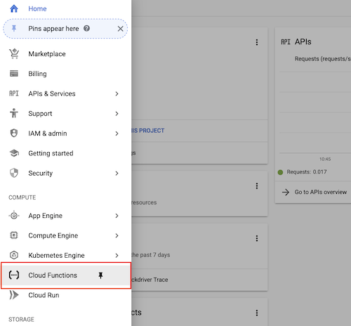
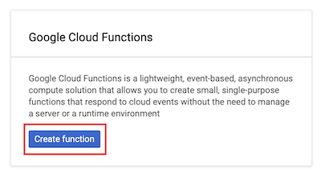
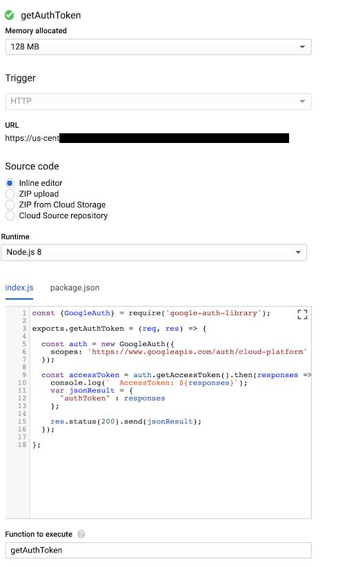
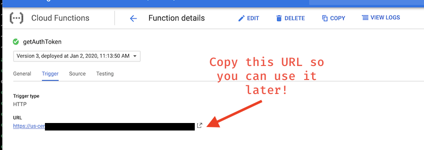
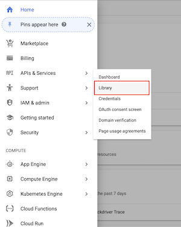
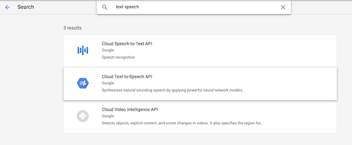
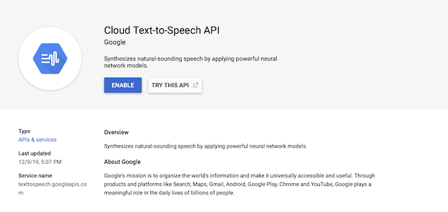

Thanks to Johnathan for drafting the readme

### Getting Access Token and Setting up GCP Project

1. Create a new project in Google Cloud Platform (https://console.cloud.google.com/)
2. Select **Cloud Functions** from the **Compute** menu in the left navigation. (If you do not already have a Google Cloud Platform account, you may be prompted to create a free trial account.) <br> 
3. Select the option to **Enable billing** for this cloud project. **Note:** If you do not see the option to enable billing, you may need to open the settings page for your Google Cloud Platform account and add your credit card information.) 
4. Click **Create Function**. <br> 
5. Name the function **authToken**, and set the memory allocation to 128 MB.
6. Copy the following into the `index.js` and `package.json` editors: 

For `index.js`:
```js
const {GoogleAuth} = require('google-auth-library');

exports.getAuthToken = (req, res) => {

  const auth = new GoogleAuth({
    scopes: 'https://www.googleapis.com/auth/cloud-platform'
  });

  const accessToken = auth.getAccessToken().then(responses => {
    console.log(`  AccessToken: ${responses}`);
    var jsonResult = {
      "authToken" : responses
    };

    res.status(200).send(jsonResult);
  });

};
```

For `package.json`:

```json
{
  "name": "authToken",
  "version": "0.0.1",
  "dependencies": 
  {
    "google-auth-library" : "^5.2.0"
  }
}
```

7. Set the **Function to execute** to `getAuthToken`. Your page should look something like this: <br> 
8. Click **Create**. It may take a few seconds to process.
9. Copy the trigger URL for the function to a separate note, so you can use it in your skill code. Find this URL by clicking the name of your function on the Cloud Functions page. Then choose **Trigger** from the top menu. <br> 

### Enabling the Text-to-Speech API

The last step in configuring the Google project is to enable the text-to-speech API. Follow these steps to do so:

1. Open the left menu of the Google Cloud Platform console for your project and select **APIs & Services** &rarr; **Library**. <br> 
2. Search for **text-to-speech** and select **Cloud Text-to-Speech API** from the search results. <br> 
3. Click **Enable**. <br> 

There you have it! The cloud function is ready to go, and the text-to-speech API is enabled. The next step is to update the skill's JS file with our credentials

### Updating your Credentials

Before we can use the skill we must update the skill's JS code to use our unique *Project ID* and the *trigger URL* for our cloud function.

Open the skill's JS file from your local copy of this repository in a text editor. You should see the `setCredentials()` function declared near the top of the skill file:

```js
function setCredentials() 
{
    misty.Set('cloudFunctionAuthTokenURL', "YOUR_TRIGGER_URL_TO_GOOGLE_CLOUD_FUNCTION_THAT_PROVIDES_ACCESS_TOKEN", false);
    misty.Set("langCodeForTTS", "en-US", false);
}
```

Update the calls on the `misty.Set()` method as follows:

1. Set `"YOUR_TRIGGER_URL_TO_GOOGLE_CLOUD_FUNCTION_THAT_PROVIDES_ACCESS_TOKEN"` to the URL for your cloud function trigger.
2. **Optional:** Change the [language code for the text-to-speech API](https://cloud.google.com/text-to-speech/docs/voices) (set in the template to `"en-US"`) to have Misty speak in a different language.
3. Save your changes.
